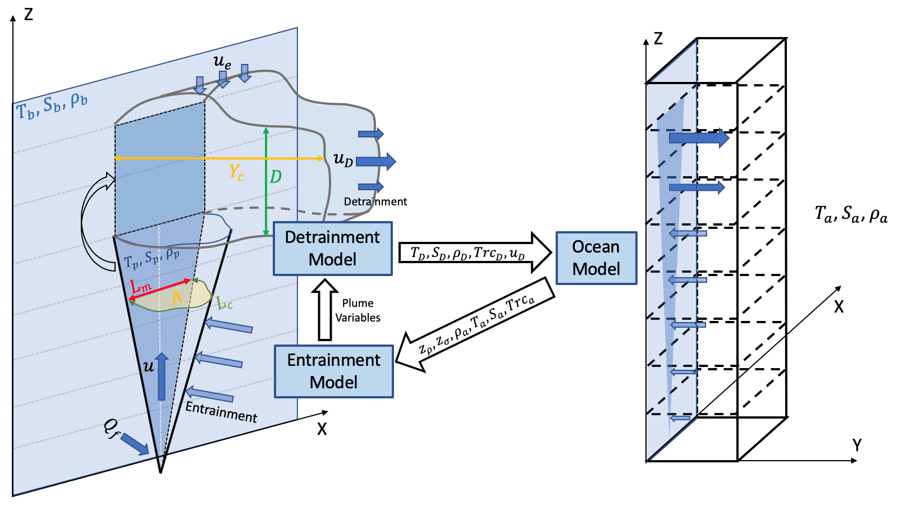
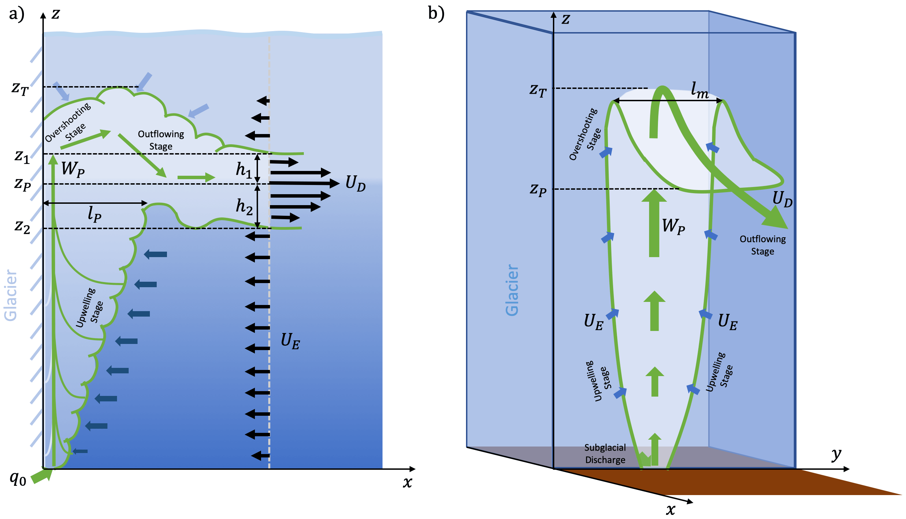
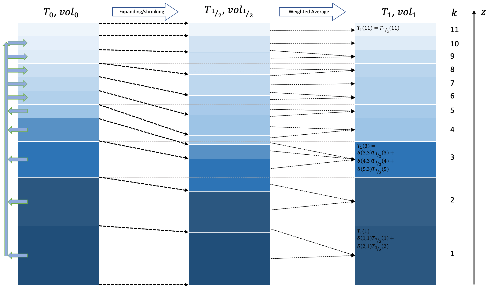
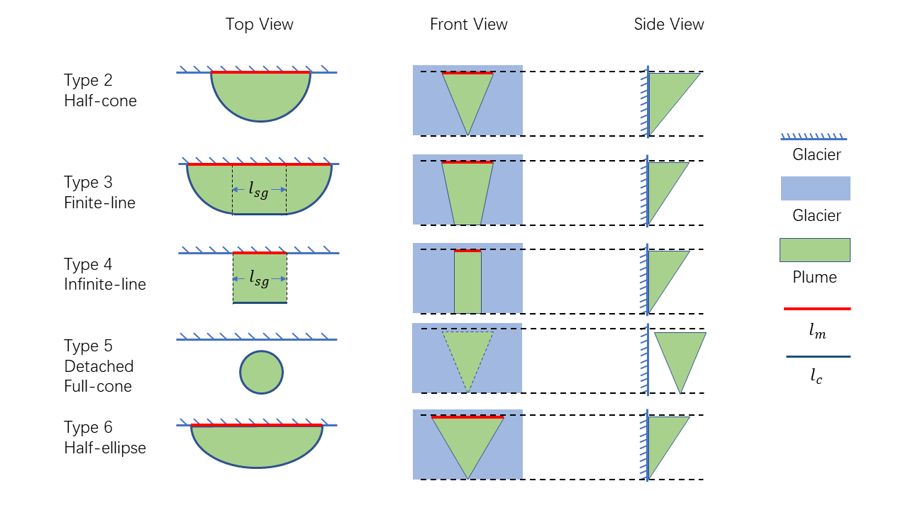

**ROMS-ICEPLUME**

Buoyant plume theory coupled with Rutgers ROMS.

This repository contains code of the Buoyant Plume Theory (BPT)/ROMS Coupled Model. Previously the model is developed based on Kate's ROMS branch (ROMS-ice) in order to allow coupling with sea-ice model.

However, Kate's ROMS is heavily modified and contains a lot of uniform configurations, which is potentially buggy. Since so far we haven't get the chance to couple the model with sea-ice, it is reasonable to migrate back to Rutgers ROMS to maintain a tidy version of the code.

This document is an introduction to the work in process ICEPLUME module for ROMS. It is modified from a similar package, IcePlume for the MITgcm, first developed by Dr. Tom Cowton. A detailed description of the MITgcm version is in [Cowton et al. (2015)](#key-references).

**Contents**

- [Overview](#overview)
- [Theory](#Theory)
  - [Buoyant Plume Theory](#buoyant-plume-theory)
  - [Outflow Parameterization](#outflow-parameterization)
  - [Couplers](#couplers)
- [Numerical Implementation](#numerical-implementation)
  - [Code Structure](#code-structure)
  - [CPP Options](#cpp-options)
  - [Model Inputs](#model-inputs)
- [Analytical Test Case](#analytical-test-case)
- [Key References](#key-references)
- [Contact Info](#contact-info)
- [Updates](#updates)
  - [Ver 1.1.0](#ver-1.1.0)
  - [Ver 1.1.1](#ver-1.1.1)
  - [Ver 1.1.2](#ver-1.1.2)

---

## Overview

In ROMS, freshwater discharge is treated as point source going into a ROMS grid, which is activated by the compiling options **LuvSrc** or **LwSrc**. It reads in a total discharge (*Qbar*), a prescribed vertical weight function (*Qshape*), and tracer concentrations (T, S and passive), and volume/tracers are injected into a grid cell through horizontal advection (**LuvSrc**) or vertical convergence (**LwSrc**).

This method works well for shallow estuaries with a barotropic freshwater discharge forcing. In most cases, the freshwater is advected into the grid uniformly (*Qshape=1/N* or *Qshape=dz/H*. The expansion in volume and dilution of tracers drives a gravitational flow, which adjusts quickly to form an estuarine circulation.

However, the freshwater discharge is not always uniform in vertical direction. At high latitude, especially fjordic systems, summer meltwater can permeate the glacier through cracks and pores, and releases at the bottom of glacier head. If the glacier extends into the ocean, the freshwater discharge is injected at depth, which is called subglacial discharge.

In fjordic systems, the depth of subglacial discharge can be a few hundreds of meters. The runoff water is cold and fresh, rises and entrains the ambient water until it reaches a neutral buoyant layer. This process is non-hydrostatic, which cannot be accurately simulated by ROMS. Therefore, a parameterization for this process is required to correctly model subglacial discharge.

This document is a technical manual to introduce the ROMS-ICEPLUME coupled model, which uses a set of parameterizations to represent the subglacial discharge driven circulation in fjords. The parameterizations for entrainment, detrainment, background melting and coupler options are described in [the Theory Section](#theory); code structure is briefly summarized in [the Code Structure Section](#code-structure); steps for model usage are given in [the Example Case](#example-case).

**Figure 1:** Schematics of the ROMS-ICEPLUME model framework.

## Theory
### Buoyant Plume Thoery

The buoyant plume theory (BPT) is a set of equations that describes the development of buoyant plume rising near an ocean/glacier boundary. It is first described using a one-dimensional model by [Jenkins (1991, 2011)](#key-references), which assumes the plume initiates from a line source and only grows in direction normal to line source. Later this model is modified by [Cowton et al. (2015)](#key-references), which assumes the plume initiates from a point source instead of a line source, and grows uniformly in horizontal direction. In reality it is likely that the development of buoyant plume falls in between the two cases [(Jackson et al., 2017)](#key-references). In this section we attempt to use a ‘generalized’ buoyant plume model to describe both cases. This generalized model gives more flexibility in modeling different geometries of buoyant plume, and is also convenient for numerical applications. 

To summarize, the development of buoyant plume is controlled by the following BPT equations: 

![eq1][1]

where *A* is the plume cross section area, *u* is the velocity along plume transport axis, *g'=g(ρa-ρp)/ρ0* is the reduced gravitational acceleration. The temporal derivative of mass,  is the submarine melt rate from the glacier wall. *T*, *S* and *ρ* are temperature, salinity and density. The subscripts *a*, *p* and *b* indicate the plume model component of ambient water, plume water, and boundary layer, respectively. The ambient conditions are read from ROMS at each baroclinic time step. *ΓT* and *ΓS* are non-dimensional turbulent transfer coefficients, and *Cd* is the ice-plume drag coefficient.

The parameter *α* is a constant entrainment rate. It determines the growth rate buoyant plume. It is the key parameter controlling the model behavior. Historically *α=0.1* is the conventional value [(Jenkins, 2011; Cowton et al., 2015)](#key-references), which is also verified by recent numerical studies [(Ezhova et al., 2018)]($key-references).

*Lm* and *Lc* are length of the cross section that is in contact with the glacier ice wall and the ambient water, respectively. In this model the plume can take any arbitrary shape as long as *Lm* and *Lc* can be determined. For example, when *Lm=2b*, *Lc=πb*, and *b=√(2A/π)*, The BPT Equations degenerate into the point source model [(Cowton et al., 2015)](#key-references), where *b* is the radius of the ‘half-cone’ plume. When *Lm=Lc=const* and *A=D∙const*, the BPT Equations degenerate into the line source model [(Jenkins, 2011)](#key-references), where *D* is the thickness of plume. For other plume geometries, *Lm* and *Lc* can be determined analytically or numerically. 

The BPT equations can be easily interpreted as the conservation of mass, momentum, heat and salt. In The first equation, *Au* is the volume flux through a horizontal transect; the first term on RHS is the entrainment of volume from the ambient water; the second term on RHS is the volume of melted water from glacier wall. In the second equation, *Au2* is the momentum flux through a transect; the first term on RHS is the buoyancy force; the second term on RHS is the friction (drag) from ambient water. In Equations third and fourth equations, the first and second terms on RHS are similar to that of the first equation; the third terms are turbulent mixing of temperature and salinity between plume and boundary layer. 

The melting of plume-ice boundary layer is described by a set of three equations [(Holland & Jenkins, 1999)](#key-references)

![eq2][2]

where *ci* and *cw* are heat capacity of ice and water, *L* is the latent heat of melting/freezing, *Ti* is the temperature of glacier ice, *λ1*, *λ2*, and *λ3* are constants of linearity. The first equation is the heat budget during melting/freezing; LHS is the total heat absorbed by ice; RHS is the heat transfer from plume water to the glacier wall using a bulk flux formula. The second equation is similar to the first one but for salt budget. The last equation is the linear relationship between melting temperature as a function of salinity and depth.

A list of constants and parameter values are listed in the Table below. By solving the BPT and melting Equations, it gives the volume flux and tracer concentration of the buoyant plume (*A*, *u*, *Tp*, *Sp*), which is then coupled with the ocean model.

| Symbol            | Name                                   | Value    | Units                             |
| ----              | ----                                   | ----     | ----                              |
| *α*               | Entrainment Rate                       | 0.1      |                                   |
| *ci*   | Ice heat capacity                      | 2009     | J∙kg-1∙°C-1 |
| *cw*   | Water heat capacity                    | 3974     | J∙kg-1∙°C-1 |
| *ρ0*   | Reference ambient water density        | 1020     | kg∙m-3                 |
| *ρice* | Reference ice density                  | 916.7    | kg∙m-3                 |
| *L*               | Latent heat of melting                 | 335000   | J∙kg-1                 |
| *ΓT*   | Thermal turbulent transfer coefficient | 0.022    |                                   |
| *ΓS*   | Salt turbulent transfer coefficient    | 0.00062  |                                   |
| *Cd*   | Ice/ocean drag coefficient             | 0.065    |                                   |
| *λ1*   | Freezing point salt slope              | -0.0573  |                                   |
| *λ2*   | Freezing point offset                  | 0.0832   |                                   |
| *λ3*   | Freezing point depth slope             | 0.000761 |                                   |
| *Ti*   | Ice temperature                        | -10      | °C                                |
| *ubkg* | Minimum background velocity            | 0.3      | m∙s-1                  |

The background melt rate is calculated following the same melting Equations by substituting the plume temperature, salinity and velocity *Tp*, *Sp* with the ambient temperature and salinity *Tp*, *Sp*. The melt rate is then corrected for the surface area since portion of the grid cell is covered by the buoyant plume where the melting rate is calculated already.

This background melt parameterization is known to underestimate the melt rate by at least one order of magnitude [(D. A. Sutherland et al., 2019)](#key-references). The parameterization of [Holland and Jenkins (1999)](#key-references) is first developed to estimate melt rate below ice shelves, which are horizontally aligned on top of seawater. Since the meltwater is fresher than seawater below, it forms a hydrostatically stable layer, which tends to prevent further melting. Near a vertically aligned glacier/ocean boundary, melt water is hydrostatically unstable compared to ambient water, and convection cells tend to form which accelerates melting. This may partly explain the underestimated melt rate. A temporary solution is to increase the background velocity *ubkg*, which guarantees a minimum amount of melting; however, the melt rate produced is still significantly lower than field observations.

### Outflow Parameterization

**Figure 2:** Schematics of the detrainment parameterization.

To simplify the problem, the ambient stratification is represented with a two-layer setup, where *ρ1<ρ2* are average densities of the upper and lower layer, respectively; *g'=g(ρ1-ρ2)/ρref* is defined as the reduced gravity between two layers; *ρref* is a reference density and *g* is the gravitational acceleration. Subglacial discharge plume rises along the glacier wall, during which the plume properties are predicted by the BPT. The plume density is *ρp* when the rising stage terminates. If the value of *ρp* falls between the densities of the two layers (*ρ1<ρp<ρ2*), the outflowing plume forms near the density jump; otherwise the plume outflows at surface and travels downstream as gravity current. Assuming that the plume detrains as one uniform water mass, the nose speed *UD* of the outflowing current is estimated with an empirical parameterization developed by [Noh et al. (1992); Ching et al. (1993)](#key-references). For outflow in two-layer fluid, the nose velocity is dependent on a modified Richardson number

![eq3][3]

where *lp* is a length scale of the buoyant plume (roughly the along fjord width of the upwelling plume), and *WP* is the scale of vertical velocity of the plume during rising stage. Both *lP* and *WP* are predicted by the BPT. The outflow velocity is then calculated using a piecewise function

![eq4][4]

Even though the [Ching et al. (1993)](#key-references) parameterization is empirically derived, the dependence on Richardson Number suggests it is tightly related to the laws of stability in sheared flow. When stratification is weak (i.e., *Ri<6*), the upwelling plume overshoots deeply into the top layer, and the transition from an upwelling plume to a horizontal outflow is very slow. Therefore, the outflow adjusts on a Richardson Number bases, coinciding with the behavior of a gravity current. When stratification is strong (i.e., *Ri>6*), the overshooting phase is short, and the density interface acts like a solid boundary [(McConnochie et al., 2020)](#key-references), redirects the momentum from vertical to horizontal direction (with a 5% loss), thus the dependence on Richardson Number is weak and nose velocity is scaled with *WP*. When stratification is very wake and the plume density is smaller than the surface layer, the outflow emerges at surface, and the expression of Ri>6 is adopted to determine the nose velocity since air-sea interface also acts as a large density interface, similar to the strongly stratified scenario.

The next step is to determine the velocity structure of the outflow which we based on the velocity profiles reported by Ching et al. (1993); Baines (2002). We use an asymmetric Gaussian function to approximate the velocity profile; the Gaussian shape is able to generate a smooth transition from the core of outflow to the ambient water, and reduces the artificial mixing caused by unrealistic shear.

The assumed expression of the Gaussian velocity profile is

![eq5][5]

This expression is asymmetric around the outflow core depth *ZP*; on either side it is normalized by length scales *h1*, *h2*. The standard deviation *σ* is determined arbitrarily; *σ→+∞* corresponds to a uniform *UD* in the outflow. In general, *σ=0.5* is a reasonable value to provide a smooth profile for numerical implementation.

The corresponding outflow volume flux (per unit depth) is *qD(z)=lmuD(z)*, where *lm* is roughly the ‘width’ of the plume (see Figure 2) predicted by BPT. The total outflow volume flux is then

![eq6][6]

which is equivalent to the upwelling plume volume flux predicted by BPT; since the profile is gaussian on either side, its integration can be easily computed. Therefore, the total thickness of the outflow is

![eq7][7]

When a gravity current intrudes into a two-layer stratified fluid, in most cases the intrusion is asymmetric [(Ungarish, 2010)](#key-references). As a result, the vertical extents of the outflowing plume below and above the layer boundary are usually not equal (*h1≠h2*), and the intrusion depths into upper and lower layer need to be determined independently. Following [Ungarish (2010)](#key-references), *h1* and *h2* are determined by matching the pressure at the base of outflow with the pressure of the ambient water of the same depth.

When the buoyant plume detrains from the glacier front, it pushes ambient water downstream and changes the local pressure. The pressure at the bottom of the outflow (*Z2* in Figure 2) is estimated by integrating from surface

![eq8][8]

At the same depth, the ambient water pressure is

![eq9][9]

The ‘steady’ condition for gravity current intrusion requires *P2=P'2*. When *P2<P'2*, the dense ambient water (*ρ2*) is forced to move upstream, lifting the buoyant plume to a shallower depth; when *P2>P'2*, the outflow water mass sinks and pushes the ambient water downstream. Rearranging the equations,

![eq10][10]

and at this stage the properties of outflow are fully determined.

### Couplers

Once the entrainment/outflowing rates are calculated, the fluxes are added to the ROMS grid as point sources in each vertical level. Previously, ROMS provides two options to add point source into a grid cell: **LuvSrc** or **LwSrc**, where the point source is prescribed as horizontal or vertical mass fluxes, respectively. Similarly, to incorporate entrainment/outflow fluxes in ROMS, the simplest method is to prescribe a horizontal mass flux from a nearby ocean grid (hereinafter **HMass**), which takes advantage of the existing framework of **LuvSrc**. When **HMass** is activated, the horizontal velocity from glacier to ocean is determined by

![eq11][11]

where *qD* and *qE* are total entrainment and outflow volume fluxes into/out of a ROMS grid cell predicted by BPT and the outflow parameterization; *dx*, *dy* and *dz* are length dimensions of the ocean grid; *k* is the grid cell index in vertical direction.

In the second method, the point source is prescribed as vertical mass fluxes (hereinafter **VMass**), which is implemented as an increment in vertical velocity

![eq12][12]

where *A=dxdy* is the area of the grid. In ROMS this is equivalent to adding convergence/divergence in an ocean grid. This is the default method to add point source in MITgcm, and is later adopted by [Cowton et al. (2015)](#key-references) to couple the buoyant plume model with ocean model.

The tracer fluxes, *T*, on the other hand, are independent of the choices of **HMass** or **VMass**

![eq13][13]

where *TAm* and *TP* are tracer concentrations of the ambient water and plume water, respectively.

The third method (hereinafter **Mix**), unlike **HMass** or **VMass**, does not add horizontal or vertical mass fluxes to the ocean grid. This method is newly developed to process the large values of plume driven convergence and divergence in **VMass**, which generates instabilities in numerical implementations. Since subglacial discharge overturns deep, high density water to shallower depths [(Straneo & Cenedese, 2015; Beaird et al., 2018)](#key-references), the isopycnals near the neutral buoyant depth *ZP* will be distorted as a result of the overturning. Baroclinic pressure gradient then drives the exchange flow, forming an outflowing plume similar to **VMass**. Unlike **VMass**, **Mix** calculates the expanding/shrinking of isopycnals internally; then the new profiles of tracers are rewritten back into the ocean grid before the execution of baroclinic timestep to mimic the distortion in isopycnals.

**Figure 3:** Schematic diagram of coupler **Mix**.

In **Mix**, we consider each grid cell is a rectangular box of volume *vol0(k)=Adz(k)* and uniform tracer concentration *T0(k)*. Each grid cell is allowed to expand/contract and modify its tracer concentration based on the volume and tracer flux into or out of the cell by entrainment *qE* and outflow *qD* (Figure 3). Integrating over one baroclinic timestep *∆t*, the volume and tracer concentration for each level become

![eq14][14]

The subscript  denotes that this is merely an intermediate step. After this step the vertical grid spacing is distorted, and a transformation is required to project the new profile back to the original grid space (Figure 3). This is achieved by weighted averaging

![eq15][15]

where *0≤δ≤1* is the weight function of each level to transform from the intermediate to original grid space. The value of *δ* is 0 where the intermediate grid does not overlap with the original grid, and is between 0 and 1 if the two partially overlap. After the transformation, tracer concentration profile is rewritten back into the ocean model, without introducing any momentum into the grid cells.

In a hydrostatic GCM like ROMS, **Mix** and **VMass** generate very similar solutions. The advantage of **Mix** over **VMass** is that it is numerically stable and can tolerate much larger baroclinic timesteps. One limitation of **Mix** is that it cannot properly represent the barotropic response of buoyant plume. However, since the circulation driven by subglacial discharge is mostly baroclinic, the overall barotropic contribution is minimal and sometimes can be neglected.

In ROMS, the options **LuvSrc** and **LwSrc** are generally used to represent rivers in estuarine and coastal simulations. Fluxes of freshwater are added as uniform barotropic flow from one end of a narrow river channel, in which case **LuvSrc** and **LwSrc** produce similar results. Subglacial discharge, on the other hand, drives strong baroclinic circulation in the near field. The barotropic signal is relatively weak, and the prescribed fluxes are naturally associated with great shear. As a result, **HMass**, **VMass** and **Mix** are expected to produce very different results due to the way that initial shear is prescribed. Moreover, subglacial discharge drains into fjords through opening of ~100 m width, which is relatively small compared to the width of glacier front (1-10 km). As a result, unlike a river, the outflowing plume near the glacier front is not bounded by topography and will spread laterally. Since **VMass** and **Mix** prescribe the outflow without initial horizontal momentum in the along channel direction, the outflow behaves more isotropic and balloons out in all direction; on the other hand, **HMass** prescribes the outflow with momentum in along channel direction, thus produces a jet-like flow in the near field. The outflow produced by **HMass** is significantly different from **VMass** and **Mix**, and is more consistent with observations from in-situ surveys.

## Numerical Implementation

### Code Structure

ROMS-ICEPLUME is forked from the Rutgers ROMS. It contains several additional FORTRAN source code files as well as modifications to the original code. New source code files are located in *ROMS/IcePlume*. The module is written in three source code files:

- *mod_iceplume.F*: This file contains model constants, parameters, shared variables and arrays for ICEPLUME. All profiles of plume status are stored in TYPE **PLUME**, which is also accessed by the ocean model.

- *iceplume_opkd.F*: This file contains an ODE solver, ODEPACK, developed by [Hindmarsh (1982)](#key-references). It is originally written in FORTRAN 77, here it is revamped to be compatible with the ROMS C preprocessor.

- *iceplume.F*: This file contains the main module **iceplume_mod**. The main functions in this module are
  - **iceplume_init**, which initialize the plume model during the initialization stage in *initial.F*.
  - **iceplume**, which communicates between the plume model and ocean model.
  - **iceplume_mix**, which implements the **ICEPLUME_MIX** method.
  - **iceplume_spread**, which spreads the buoyant plume fluxes in adjacent grids. EXPERIMENTAL!!! DO NOT USE
  - **iceplume_entrain**, which calculates entrainment and melt rates. The related subroutines are
    - **general_entrain_model**, which contains the BPT equation code and is called repeatedly by the ODE solver;
    - **plume_metrics**, which is used to calculate *Lm* and *Lc* based on the model type.
  - **iceplume_detrain**, which contains the detrainment model. This subroutine calculates velocity and tracer profiles of the outflow.
  - **iceplume_calc**, which contains the wrapper function that calls the plume entrainment and detrainment melting models. It also calculates volume and tracer fluxes and background melt rates. The related subroutine is
    - **iceplume_meltrate**, which calcuates background meltrate using the three-equation parameterization.
  - **rho**, which computers in-situ density.
  - **sw_temp**/**sw_ptmp**/**sw_adtg**, which calculates in-situ temperature. These three functions are modified from the **MITgcm** code repository.
  - **linint**, which performs linear interpolation.

To couple ICEPLUME to ROMS, a few pieces of code are added/modified in the following source codes:

- *ROMS/Utility/checkdefs.F*: Add ICEPLUME as a C-preprocessor definition.

- *ROMS/Modules/mod_arrays.F*: Allocate types and arrays to initiate ICEPLUME model.
- *ROMS/Modules/mod_scalars.F*: Relax maximum speed threshold to 100 m/s when ICEPLUME is activated.
- *ROMS/Modules/mod_sources.F*: Define ICEPLUME input variables in TYPE **SOURCES**.
- *ROMS/Modules/mod_ncparam.F*: Define variables to read plume model parameters/forcing from the river netCDF file.
- *ROMS/Nonlinear/set_idata.F*: Read plume model parameters (depth/length/type, etc.) from river netCDF file.
- *ROMS/Nonlinear/get_data.F*: Read raw plume model forcing (subglacial discharge, tracer concentration, etc.) data from river netCDF file.
- *ROMS/Nonlinear/set_data.F*: Interpolate plume forcing data to time of calculation from raw forcing data.
- *ROMS/Nonlinear/initial.F*: Initiate variables for plume model.
- *ROMS/Nonlinear/main3d.F*: Call the ICEPLUME model.
- *ROMS/Nonlinear/step2d_LF_AM3.F*: If use Luv coupler, set the 2-D horizontal advection forced by plume; If use Lw coupler, set the increment in Zeta forced by plume.
- *ROMS/Nonlinear/step3d_uv.F*: If use Luv coupler, set the 3-D horizontal advection forced by plume.
- *ROMS/Nonlinear/omega.F*: If use Lw coupler, set the 3-D vertical velocity forced by plume.
- *ROMS/Nonlinear/step3d_t.F*: Set 3-D tracer fluxes forced by plume.
- *ROMS/Nonlinear/pre_step3d.F*: Pre-step for 3-D velocity and tracer fluxes.
- *ROMS/External/varinfo.dat*: Add variable ids for plume model.

### CPP Options

The current version of ICEPLUME is based on Rutgers ROMS version 3.9. To activate the basic functionality of ICEPLUME, add **#define ICEPLUME** in your application header file before compiling. Once **ICEPLUME** itself is defined, the following options can be used to add additional configurations:

- **ICEPLUME_MELT**

    By default, background melt is not calculated in ICEPLUME. Use this option to activate calculation of background melt rate.

- **ICEPLUME_TRACER**

    Use this option to activate tracer computation of subglacial discharge. Requires **T_PASSIVE**.

    This option is now automatically turned on when both ICEPLUME and T_PASSIVE are defined (check *globaldeffs.h*). No need to define this option in the header file.

- **ICEPLUME_MELT_TRACER**

    Use this activate tracer computation of plume and ambient melt water. When this method is used, the last two dye types (**NT(ng)-1**, **NT(ng)**) will be used for the plume melt and background melt water, respectively; do not use them for other purpose, and make sure **NPT>2** in your roms_\*.in file.

- **ICEPLUME_DET_AVERAGE**

    When determining the neutral buoyancy depth of buoyant plume, profiles of tracers from the ocean model are used to determine the ambient density. If this option is activated, the ambient density profile will be determined by averaging over a pre-defined domain near the point source. This is a very useful option in keeping the outflow steady.

- **ICEPLUME_MIX**

    Use this option to activate the **Mix** coupler and deactivate **HMass**/**VMass** coupler.

Other than the above model configurations, there are other experimental CPP options that are not recommended for general use (and might be removed in future)

- **ICEPLUME_DET_NO**

    Use this option to disable the detrainment model.

- **ICEPLUME_SHOOT_NO**

    Use this option to disable calculating of overshooting stage in the upwelling plume model.

- **ICEPLUME_DET_BULK** (**REMOVED**)

    Use a bulk formula (instead of adding layers from above/below) to calculate *h1* and *h2*.

- **ICEPLUME_DET_IWCP** (**REMOVED**)

    Use internal wave speed (instead of the Ching93 outflow parameterization) to estimate *UD*.

- **ICEPLUME_DET_NEUTRAL**

    Use this option to make tracer concentrations of buoyant plume at different levels match the ambient water.

- **ICEPLUME_SLOPE**

    Use this option to activate the **Slope** coupler, a linear combination of **Mix** and **HMass**. Requires **ICEPLUME_MIX**.

### Model Inputs

When **ICEPLUME** is activated, ROMS needs to read in additional variables from the river netCDF file, including:

- **subglacial_depth**

    Dimension (‘river’), grounding line depth. This value is negative and is in accordance with the ROMS depth metrics. If the value is greater than 0, the model assumes grounding line is at the bottom, and the grounding line depth is equal to water depth. If it is a negative number, the grounding line depth will be the first ω layer above this number.

- **subglacial_length**

    Dimension (‘river’), denoted as *lsg*, the length of ‘crack’ on glacier, which is also the width of subglacial river. It is used by subglacial_type 3 and 4.

- **subglacial_type**

  Dimension (‘river’), a numerical value determines the type of BPT model. Acceptable values are

  - 0, no subglacial runoff or melting.
  - 1, no subglacial discharge, only background melting.
  - 2, point source (half-cone, [Cowton et al., (2015)](#key-references)) model.
  - 3, finite-line source model, the sheet model (TYPE 4) combined with two 1/4 cones.
  - 4, infinite-line source (sheet, [Jenkins (2011)](#key-references)) model.
  - 5, detached full cone model, this can be used for non-glacial situations such as hydrothermal vents.
  - 6, half ellipse model, with an aspect ratio pre-defined in *mod_iceplume.F*.

  A very crude diagram of the shape of different plume type is in Figure 4.

- **subglacial_transport**

    Dimension (‘river_time’, ‘river’), subglacial discharge rate.

- **subglacial_temp**

    Dimension (‘river_time’, ‘river’), subglacial discharge initial temperature.

- **subglacial_salt**

    Dimension (‘river_time’, ‘river’), subglacial discharge initial salinity.

- **subglacial_dye_**

    Dimension (‘river_time’, ‘river’), subglacial discharge passive trace concentration.

- **subglacial_Erange**

    Dimension (‘loc’, ‘river’), average span in Eta direction for the detrainment model. This is only required by **ICEPLUME_DET_AVERAGE**. The dimension ‘loc’ is constantly 2.

- **subglacial_Xrange**

    Dimension (‘loc’, ‘river’), average span in Xi direction for the detrainment model.

- **subglacial_angle**

    Dimension (‘river’), angle of glacier/ocean boundary. This is only used by **ICEPLUME_SLOPE**.

For more information, contact the developer for a sample river netCDF file or a python script.
The ICEPLUME model has a standalone version that is able to calculate the plume status offline using ROMS forcing and history files. It has a series of python-based scripts that helps to automate the calculation. Contact the developer if you need a tryout.

**Figure 4:** Schematic diagram of different plume types.

## Analytical Test Case
An analytical test case is provided for users to try out this coupled model. The files for this case is located in *./Iceplume_Test*. It is a pure analytical case, thus no extra file is needed. The test domain is a rectangular basin, with an open boundary towards the east side. Horizontal resolution is uniformly 220 m; the total domain size is determined by Lm and Mm in the *roms_iceplume_test.in* file. The first two rows of grid are masked to represent the glacier; subglacial discharge is injected from the center of the glacier into the channel. The channel is uniformly 200 m deep.

Initially the channel is stratified by a strong halocline at 50 m (set in *roms_iceplume_test.in*). Subglacial discharge of 200 m3s-1 is injected from bottom (200 m), and a finite-line style plume of 220 m wide is used. Details of the plume parameters are set in *src/ana_psource.h*.

To run this test case, set the right path in the *build_roms.bash* file and compile. Different model options can be activated in *src/iceplume\_test.h*; the default setup is the recommended one for most users.

---

## Key References

[Ching, C. Y., Fernando, H. J. S., & Noh, Y. (1993). Interaction of a Negatively Buoyant Line Plume with a Density Interface. Dynamics of Atmospheres and Oceans, 19(1-4), 367-388.](https://www.sciencedirect.com/science/article/abs/pii/0377026593900426)

[Cowton, T., Slater, D., Sole, A., Goldberg, D., & Nienow, P. (2015). Modeling the impact of glacial runoff on fjord circulation and submarine melt rate using a new subgrid‐scale parameterization for glacial plumes. Journal of Geophysical Research: Oceans, 120(2), 796-812.](https://agupubs.onlinelibrary.wiley.com/doi/10.1002/2014JC010324)

[Hindmarsh, A. C. (1982). ODEPACK, a Systematized Collection of ODE Solvers: Lawrence Livermore National Laboratory.](https://computing.llnl.gov/projects/odepack)

[Sutherland, D. A., Jackson, R. H., Kienholz, C., Amundson, J. M., Dryer, W. P., Duncan, D., et al. (2019). Direct observations of submarine melt and subsurface geometry at a tidewater glacier. Science, 365(6451), 369.](https://science.sciencemag.org/content/365/6451/369.full)

[Ezhova, E., Cenedese, C., & Brandt, L. (2018). Dynamics of Three-Dimensional Turbulent Wall Plumes and Implications for Estimates of Submarine Glacier Melting. Journal of Physical Oceanography, 48(9), 1941-1950.](https://journals.ametsoc.org/view/journals/phoc/48/9/jpo-d-17-0194.1.xml)

[Holland, D. M., & Jenkins, A. (1999). Modeling thermodynamic ice-ocean interactions at the base of an ice shelf. Journal of Physical Oceanography, 29(8), 1787-1800.](https://journals.ametsoc.org/view/journals/phoc/29/8/1520-0485_1999_029_1787_mtioia_2.0.co_2.xml?tab_body=fulltext-display)

[Jenkins, A. (1991). A One-Dimensional Model of Ice Shelf-Ocean Interaction. Journal of Geophysical Research-Oceans, 96(C11), 20671-20677.](https://agupubs.onlinelibrary.wiley.com/doi/abs/10.1029/91JC01842)

[Jenkins, A. (2011). Convection-Driven Melting near the Grounding Lines of Ice Shelves and Tidewater Glaciers. Journal of Physical Oceanography, 41(12), 2279-2294.](https://journals.ametsoc.org/view/journals/phoc/41/12/jpo-d-11-03.1.xml)

[McConnochie, C. D., Cenedese, C., & McElwaine, J. N. (2020). Surface Expression of a Wall Fountain: Application to Subglacial Discharge Plumes. Journal of Physical Oceanography, 50(5), 1245-1263.](https://journals.ametsoc.org/view/journals/phoc/50/5/jpo-d-19-0213.1.xml)

[Noh, Y., Fernando, H. J. S., & Ching, C. Y. (1992). Flows Induced by the Impingement of a 2-Dimensional Thermal on a Density Interface. Journal of Physical Oceanography, 22(10), 1207-1220.](https://journals.ametsoc.org/view/journals/phoc/22/10/1520-0485_1992_022_1207_fibtio_2_0_co_2.xml)

Ungarish, M. (2010). An Introduction to Gravity Currents and Intrusions Introduction. Introduction to Gravity Currents and Intrusions, 1-10.

---

## Contact Info

Chuning Wang, School of Oceanography, Shanghai Jiaotong University

wangchuning@sjtu.edu.cn

---

## Updates
### Ver 1.1.0

This is a major update. In this update I attempt to fix and improve the **ICEPLUME_DET_AVERAGE** method. The major issue I had is to average data across tiles. Depending on the MPI method, accessing data from another tile may not be allowed. This happened when I run the code on a super computer with Intel MPI. Historically it has also caused issues for other uses; in my own applications I 'fix' it by manually set averaging span within a single tile.

However this simple 'patch' is not a good solution. It is necessary to design the code so it can either

- Automatically detect the tile boundary and restrict the average span within it; or

- Accessing data across tiles for the spatial averaging.

Therefore, two methods are applied to fix the same problem. The first solution is to iteratively find the boundary of each tile, and compare the averaging span with tile boundaries; this is easy to achieve, however, it may generate slightly difference solution when the domain is tiled differently. The second solution, which is more aggressive, uses ROMS internal function *mp_aggregate2d* and *mp_aggregate3d* to collect data from each tile and then apply the average. It guarantees the same averaging span each time, but exchanging data between tiles can be numerically expensive when the tile number is large.

In this new version, the default averaging method is the the first one, which thoeretically is 'faster'. To use the more aggressive approach, user needs to manually activate it with the cpp flag **ICEPLUME_CTIL_AVG** as well as the original flag **ICEPLUME_DET_AVERAGE**; **CTIL** stands for *cross tile*. User should run benchmark tests to decide which strategy works best for the machine.

Another improvement is that the spatial averaging calculation now skips land-masked points, and weight the average with respect to each grid size, which aims to serve realistic topography in future applications. Other modifications include but not limited to data broadcasting, tile exchange, etc.

Chuning Wang

2020-11-24

---

### Ver 1.1.1

More optimization on the averaging algorithm. Using ROMS internal function *mp_assemble* to substitute *mp_aggregate* in the coupling function. This is to avoid fetching global arrays of density at each timestep. Instead, each tile calculates the weighted SUM, and *mp_assemble* is used to get and broadcast the reduced sum from and to each tile; then the weighted average is calculated using the reduced sum.

Since this is a better scheme over the method introduced in [Ver 1.1.0](##Ver-1.1.0), I decide to remove the temporarily used CPP flag **ICEPLUME_CTIL_AVG**. From now on only the new default averaging method is available.

Other modifications - Previously **ICEPLUME_DET_AVERAGE** averages density profiles on \sigma surfaces. This is based on the assumption that the depth near glacier grounding is somewhat constant, which is fine for idealized simulation. To generalize for realistic applications, in the current version the density profile is averaged on z surfaces. This is realized by linearly interpolating the density profile from each grid.

Chuning Wang

2020-12-03

---

### Ver 1.1.2

Bug fixing and new README page on github. The README is rewritten using materials from my thesis.

Chuning Wang

2021-05-21

### Ver 1.1.3 [ongoing]

Move all iceplume related functions to one file *ROMS/IcePlume/iceplume.F* to pack it in a module **iceplume_mod**. The purpose is to seal the iceplume module to avoid accidental access of other model components. This is part of the preparation for coupling with an icesheet model, potentially the FISOC coupling system.

Unfortunately the ODEpack code cannot be packed into the same module due to some conflicts with F77. For now it is kept in a separate file in *iceplume_opkd.F*. I haven't had a solution on this minor problem.

Chuning Wang
2021-06-08

[1]: https://latex.codecogs.com/svg.image?\begin{aligned}\frac{d}{dz}[Au]&=\alpha&space;L_cu&plus;L_m\dot{m}\\\\\frac{d}{dz}[Au^2]&=g'A&plus;L_mC_du^2\\\\\frac{d}{dz}[AuT_p]&=\alpha&space;L_cuT_a&plus;L_m\dot{m}T_b-L_m\Gamma_TC_d^{1/2}u(T_p-T_b)\\\\\frac{d}{dz}[AuS_p]&=\alpha&space;L_cuS_a&plus;L_m\dot{m}S_b-L_m\Gamma_SC_d^{1/2}u(S_p-S_b)\end{aligned}

[2]: https://latex.codecogs.com/svg.image?\begin{aligned}\dot{m}(c_i(T_b-T_i)&plus;L)&=c_w\Gamma_TC_d^{1/2}u(T_p-T_b)\\\\\dot{m}S_b&=\Gamma_SC_d^{1/2}u(S_p-S_b)\\\\T_b&=\lambda_1S_b&plus;\lambda_2&plus;\lambda_3z\end{aligned}

[3]: https://latex.codecogs.com/svg.image?Ri=\frac{g'l_P}{W_P^2}

[4]: https://latex.codecogs.com/svg.image?U_D=\begin{cases}0.7Ri^{0.17}W_p,&\quad&space;Ri\leq0\\\\0.95W_p,&\quad&space;Ri<0\end{cases}

[5]: https://latex.codecogs.com/svg.image?u_D(z)=\begin{cases}U_D\exp{[-0.5(\frac{1}{\sigma}\frac{z-Z_P}{h_2})]},&\quad&space;Z_P-h_2<z<Z_P\\\\U_D\exp{[-0.5(\frac{1}{\sigma}\frac{z-Z_P}{h_1})]},&\quad&space;Z_P<z<Z_P&plus;h_1\end{cases}

[6]: https://latex.codecogs.com/svg.image?Q_D=\int_{Z_P-h_2}^{Z_P+h_1}q_D(z)dz

[7]: https://latex.codecogs.com/svg.image?h\equiv&space;h_1+h_2=\frac{Q_D}{l_mU_D\int_{-1}^1\exp{[-0.5(\tilde{z}/\sigma)^2]d\tilde{z}}}

[8]: https://latex.codecogs.com/svg.image?P_2=P_0+g[\rho_1(Z_P-h_1)+\rho_P(h_1+h_2)]

[9]: https://latex.codecogs.com/svg.image?P_2'=P_0+g[\rho_1Z_P+\rho_2h_2]

[10]: https://latex.codecogs.com/svg.image?\begin{aligned}h_1&=\frac{\rho_P-\rho_1}{\rho_2-\rho_1}h\\\\h_2&=\frac{\rho_2-\rho_P}{\rho_2-\rho_1}h\end{aligned}

[11]: https://latex.codecogs.com/svg.image?\begin{aligned}u(k)&=\frac{1}{dydz(k)}[-q_E(k)+q_D(k)],&space;\mathrm{or}\\\\v(k)&=\frac{1}{dxdz(k)}[-q_E(k)+q_D(k)]\end{aligned}

[12]: https://latex.codecogs.com/svg.image?\Delta&space;w(k)\frac{1}{A}\sum_{i=1}^k-q_E(i)+q_D(i)

[13]: https://latex.codecogs.com/svg.image?T(k)=\frac{1}{A}[-q_E(k)T_{Am}(k)+q_D(k)T_P]

[14]: https://latex.codecogs.com/svg.image?\begin{aligned}vol_{\frac{1}{2}}(k)&=vol_0(k)+\Delta&space;t[-q_E(k)+q_D(k)]\\\\T_{\frac{1}{2}}(k)&=\frac{[vol_0(k)-\Delta&space;tq_E(k)]T_0(k)+\Delta&space;tq_D(k)T_P}{vol_{\frac{1}{2}}(k)}\end{aligned}

[15]: https://latex.codecogs.com/svg.image?T_1(k)=\sum_{i=1}^N\sigma(i,k)T_{\frac{1}{2}}(i)
